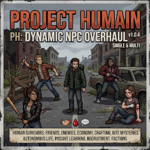

<div align="center">



# Project Humain : Dynamic NPC Overhaul

**Mod pour Project Zomboid — Build 42**

*Des survivants humains autonomes avec IA, professions, inventaire et système de santé*

[](https://github.com/sputji/dynamic_npc_overhaul/releases)
[](https://store.steampowered.com/app/108600)
[]()

</div>

---

## Présentation

**Dynamic NPC Overhaul** ajoute des PNJ humains autonomes dans Project Zomboid. Chaque PNJ a une **profession**, des **stats propres**, un **inventaire réaliste** et peut être **recruté** pour vous suivre ou rester en place. Ils encaissent les coups, jouent des animations de douleur, et meurent si leurs points de vie tombent à zéro.

> Ce mod est en développement actif. Les fonctionnalités ci-dessous sont fonctionnelles en **v0.0.18**.

---

## Fonctionnalités actuelles (v0.0.18)

### Nouveautes v0.0.18

- Hotfix critique combat ranged : suppression du crash console `Object tried to call nil in pcall` dans `getBestRangedWeapon` (filtre strict `HandWeapon` avant `isRanged`).
- Compat munitions B42 renforcee : `getAmmoType()` accepte les retours objet (`getItemKey`) ou string via normalisation.
- Stabilisation runtime B42 : garde-fous d'appels Java (`hasMethod`/`tryCall`) pour supprimer les erreurs rouge repetitives en boucle.
- Suivi plus stable : cadence de re-path reduite (`FOLLOW_REPATH_TICKS=45`) + throttling follow cote Update.
- Combat firearms fiabilise : priorite armes a feu a distance, consommation munitions robuste, checks methodes defensifs.
- Progression active : gain XP en combat (Aiming, Blunt, Strength, Fitness, Maintenance).
- Debug outfits : score defensif par slot visible (`OutfitDef`) pour valider les remplacements d'equipement.
- Detection meteo robuste : `ClimateManager` avec fallback `GameTime`.

## Fonctionnalités actuelles (v0.0.18)

### PNJ & Professions

**47 professions** disponibles (toutes issues de `clothing.xml` PZ 42.18), chacune avec ses propres statistiques, vitesse et équipement de départ. Quelques exemples représentatifs :

| Profession | Vitesse | PV | Poids max | Équipement de départ |
|------------|---------|-----|-----------|----------------------|
| 👮 Police | 0.70 | 110 | 20 kg | Matraque, Lampe torche |
| 👨‍👩‍👧 Sheriff / Détective / Sécurité / Garde | 0.68–0.70 | 100–110 | 18–20 kg | Matraque, Lampe torche |
| ⚔️ Vétéran / Militaire | 0.72 | 110–115 | 22–25 kg | Couteau, Lampe torche |
| 🚒 Pompier | 0.68 | 120 | 25 kg | Hache |
| 🩺 Médecin / Infirmière / Pharmacien | 0.62 | 90–100 | 15 kg | Bandage, Analgésiques |
| 🔧 Mécanicien / Maçon / Métallurgiste | 0.65 | 100–105 | 20–22 kg | Marteau / Clé, Lampe torche |
| 🌲 Ranger / Chasseur / Pêcheur | 0.65–0.75 | 90–105 | 18–20 kg | Couteau de chasse, Lampe torche |
| 👨‍🌾 Fermier | 0.62 | 90 | 15 kg | Pelle, Truelle |
| 👨‍🍳 Chef | 0.62 | 90 | 15 kg | Couteau de cuisine, Ouvre-boîte |
| 🧙 Civil (enseignant / étudiant / retraité…) | 0.55–0.65 | 80–85 | 12–15 kg | Variable |

Liste complète dans `PHNPC_Core.lua` → `PHNPC.OUTFIT_STATS`.

### Interactions joueur

- **Recruter** un PNJ via clic droit → il vous suit
- **Ordonner** : *Suis-moi*, *Reste ici*, *Attaque les zombies !*, *Mets-toi à l'abri*, *Va là-bas*, *Tu peux partir*
- Distance de suivi réaliste — le PNJ s'arrête à 2 tiles du joueur, recalcul uniquement si le joueur s'éloigne vraiment (pas de rotation)
- **Ouverture automatique des portes** : le PNJ ouvre (et referme) les portes sur son passage (double portes, portes garage comprises)
- **Échange d'inventaire** : accès à l'inventaire du PNJ via le menu
- **Dialogue localisé** : toutes les bulles de texte passent par le système de traduction PZ (`getText()`), EN et FR supportés (B42.18+)

### Système de santé

- Les PNJ **encaissent les coups** du joueur (dégâts calculés selon l'arme)
- **Animations de douleur** déclenchées (PainHead / PainTorso)
- **Coup critique** sur la tête → dégâts doublés
- Le PNJ **meurt** quand ses PV tombent à 0 → **corpse lootable** avec tout son inventaire

### Combat & survie

- **Combat auto** contre les zombies proches (range 8 tiles) — Shove / FrontKick / HighKick
- **Fuite** si HP < 30% — direction opposée au zombie, repli vers le joueur si zone dégagée
- **Barks contextuels** automatiques selon l'état (following, staying, defending, fleeing, idle)

### Animations

Animations humaines complètes grâce à un système d'AnimSets custom :

| Animation | Déclencheur |
|-----------|-------------|
| Marche / Idle | Déplacement et repos |
| WalkToIdle / IdleToWalk | Transitions fluides (override vanilla via `PHNPC_IsNPC=true`) |
| StaggerBack (NPC) | Repoussé — `Bob_RunStumble` (rig humain) |
| PainHead / PainTorso | Coup reçu |
| FrontKick / HighKick | Combat auto NPC |
| Shove | Repoussé |
| WaveHi / Shrug / Yes / No | Expressions sociales |

> Animations masculines (Bob) et féminines (Kate) supportées.

### Nouveautés v0.0.16

- **Armes à feu NPC** : les PNJ utilisent les armes à feu s'ils ont les munitions adaptées ET un niveau `Aiming ≥ 1`. Tir jusqu'à 10 tuiles, cooldown 120 ticks entre deux rafales.
- **Progression XP / compétences** : 13 compétences par NPC (Strength, Fitness, Aiming, Nimble, Sneaking, Axe, Blunt, SmallBlade, Maintenance, Doctor, Cooking, Carpentry, Farming). L'XP est accumulée en combat et déclenche des montées de niveau avec barks dédiés.
- **Module Outfits** : sélection et équipement automatique des vêtements selon le score défensif ; l'échange se déclenche immédiatement quand le joueur donne un vêtement (`onItemGiven`).
- **Pathfinding natif** : `pathToLocationF` (NavigatorGrid PZ) gère automatiquement les portes, fenêtres et clôtures, avec cooldown 15 ticks pour éliminer les micro-freezes.
- **Réactions météo** : barks contextuels selon la météo courante (pluie, orage, neige, canicule, brouillard) via l'API `GameTime`.
- **Architecture modulaire** : ajout de `PHNPC_Main.lua` (init centrale), `PHNPC_Pathfinding.lua` et `PHNPC_Outfits.lua`.

### Correctifs récents (v0.0.15)

- **Follow anti micro-saccades** : hold anti yo-yo autour de la distance d'arret + cadence minimale entre deux re-paths.
- **Ordres verrouilles** : `goingto/shelter` proteges via `PHNPC_OrderLock` contre les retours parasites vers le joueur.
- **Shelter stable** : quand le NPC entre dans un batiment, il passe en `staying` et ne ressort plus automatiquement.
- **Clotures/obstacles bas** : mitigation non bloquante de `ClimbOverFenceState` (reset seulement en blocage prolonge).
- **Auto-equip vetements** : compatibilite API B42 renforcee (`instanceof Clothing` + fallback worn API).
- **Loot mort fiable** : transfert cadavre avec fallback `AddItem(fullType)` pour conserver armes/objets donnes.

### Correctifs precedents (v0.0.14)

- **Follow anti-saccades** : suppression du recalcul quasi continu du follow anchor + fenêtre anti-yo-yo au stop distance.
- **Ordres stables** : verrou `goingto/shelter` pour empêcher les retours parasites vers le joueur.
- **Clôtures** : mitigation `ClimbOverFenceState` non bloquante (reset seulement en blocage prolongé).
- **Auto-équip vêtements** : détection Clothing/API B42 robustifiée, remplacement meilleur score par slot.
- **Loot mort** : les objets/armes donnés au NPC sont conservés et transférés au cadavre de façon fiable.

### Correctifs précédents (v0.0.13 / v0.0.13b)

- **Suivi stabilisé** : follow par point d'ancrage, stop à 2 tuiles, anti-collage et anti-spam re-path.
- **Mitigation clôtures** : interception défensive de `ClimbOverFenceState` avec recovery cooldown — réduit les boucles d'état et les erreurs `BodyDamage nil`.
- **Combat** : sélection de la meilleure arme en comparant arme équipée + inventaire complet NPC.
- **Auto-équip vêtements** : remplacement slot par slot selon score défensif (bulletDefense > biteDefense > scratchDefense + condition + isolation).
- **Mort/loot** : items en main (primaire/secondaire) inclus dans le snapshot de transfert au cadavre.
- **Chef** : correction item de départ (`Base.TinOpener` au lieu de `Base.CanOpener`).

---

## Installation

### Pré-requis
- **Project Zomboid Build 42** (version ≥ 42.0)
- Solo ou Multijoueur (côté client)

### Étapes

**1 — Télécharger le mod**

```
git clone https://github.com/sputji/dynamic_npc_overhaul.git
```

ou télécharger le ZIP depuis GitHub → **Code → Download ZIP**

**2 — Copier le dossier dans Zomboid**

Créer le dossier `PH_DynamicNPCOverhaul` dans :

```
C:\Users\<VOTRE_NOM>\Zomboid\mods\
```

Puis copier le contenu de **`B42/42/`** ET **`B42/common/`** dans ce dossier **en conservant la structure de sous-dossiers**.

> ⚠️ **Structure obligatoire** : `mod.info` doit être dans le sous-dossier `42/`, pas à la racine.

Résultat attendu :

```
C:\Users\<VOTRE_NOM>\Zomboid\mods\PH_DynamicNPCOverhaul\
├── 42\                              ← OBLIGATOIRE (B42 exige ce dossier)
│   ├── mod.info
│   ├── icon.png
│   ├── poster.png
│   └── media\lua\
│       ├── client\
│       │   ├── PHNPC_Actions.lua
│       │   ├── PHNPC_Barks.lua
│       │   ├── PHNPC_Combat.lua
│       │   ├── PHNPC_Convert.lua
│       │   ├── PHNPC_Danger.lua
│       │   ├── PHNPC_Debug.lua
│       │   ├── PHNPC_Enforce.lua
│       │   ├── PHNPC_Health.lua
│       │   ├── PHNPC_Inventory.lua
│       │   ├── PHNPC_Log.lua
│       │   ├── PHNPC_Manager.lua
│       │   ├── PHNPC_Menu.lua
│       │   ├── PHNPC_Orders.lua
│       │   ├── PHNPC_Pathfind.lua
│       │   └── PHNPC_Update.lua
│       └── shared\
│           ├── PHNPC_Core.lua
│           ├── PHNPC_Stats.lua
│           └── Translate\
│               ├── EN\
│               │   ├── UI_PHNPC_EN.txt
│               │   └── UI.json
│               └── FR\
│                   ├── UI_PHNPC_FR.txt
│                   └── UI.json
└── common\media\
    ├── AnimSets\zombie\
    │   └── (jeux d'animations conditionnels)
    └── anims_X\Zombie\
        └── (animations Bob/Kate custom)
```

**3 — Activer le mod**

1. Lancer Project Zomboid
2. Menu principal → **Mods**
3. Activer **"Project Humain : Dynamic NPC Overhaul"**
4. Lancer ou créer une partie

**4 — Utiliser le mod en jeu**

- **Clic droit sur le sol** → *Spawner un NPC* pour faire apparaître un PNJ
- **Clic droit sur un NPC** → menu d'interaction (Recruter, Suivre, Rester, Congédier)

---

## Menu DEBUG

Un sous-menu **DEBUG_PHNPC** est disponible via clic droit (pour les tests) :

| Option | Action |
|--------|--------|
| Spawn NPC debug | Crée un PNJ à côté du joueur |
| Afficher l'état | Affiche les stats du NPC le plus proche (HP, vitesse, métier…) |
| Animations → FrontKick | Déclenche l'animation FrontKick |
| Animations → HighKick | Déclenche l'animation HighKick |
| Animations → WaveHi / Shrug / Yes / No | Expressions |
| Supprimer NPC | Retire le PNJ le plus proche |

---

## Structure du projet

```
Dynamic_NPC_Overhaul/
├── B42/
│   ├── 42/                          ← Dossier du mod (à copier dans Zomboid/mods/)
│   │   ├── mod.info                 ← Métadonnées du mod (id, version, auteur)
│   │   ├── icon.png / poster.png
│   │   └── media/lua/
│   │       ├── shared/
│   │       │   ├── PHNPC_Core.lua    ← Namespace PHNPC, constantes, OUTFIT_STATS
│   │       │   ├── PHNPC_Stats.lua   ← Stats et inventaire par profession
│   │       │   └── Translate/        ← Traductions EN/FR (.txt + .json B42.18)
│   │       └── client/
│   │           ├── PHNPC_Actions.lua  ← Déplacement NPC
│   │           ├── PHNPC_Barks.lua    ← Système de barks
│   │           ├── PHNPC_Combat.lua   ← Combat auto vs zombies
│   │           ├── PHNPC_Convert.lua  ← Conversion zombie → NPC
│   │           ├── PHNPC_Debug.lua    ← Menu DEBUG_PHNPC
│   │           ├── PHNPC_Enforce.lua  ← Boucle OnZombieUpdate
│   │           ├── PHNPC_Health.lua   ← Système de santé
│   │           ├── PHNPC_Inventory.lua ← Inventaire NPC
│   │           ├── PHNPC_Manager.lua  ← Spawn + registres
│   │           ├── PHNPC_Menu.lua     ← Menu contextuel
│   │           ├── PHNPC_Orders.lua   ← Ordres joueur
│   │           └── PHNPC_Update.lua   ← OnTick principal
│   └── common/media/
│       ├── AnimSets/zombie/         ← AnimSets custom (idle, bumped, walk…)
│       └── anims_X/Zombie/          ← Animations .X custom (FrontKick, HighKick…)
└── Docs/
    └── B42/
        ├── ARCHITECTURE.md          ← Architecture technique détaillée
        ├── CHANGELOG.md             ← Historique des versions
        └── feuille de route.md      ← Roadmap complète
```

---

## Roadmap

| Phase | Fonctionnalité | État |
|-------|----------------|------|
| v0.0.14 | Stabilisation follow/ordres + fix auto-equip vetements + fix loot des objets donnes | ✅ |
| v0.0.13b | Mitigation `ClimbOverFenceState` + auto-équip vêtements best-stat par slot | ✅ |
| v0.0.13 | Stabilisation follow/combat/loot, auto-équip vêtements, correction Chef | ✅ |
| v0.0.9k | Refonte gameplay : path-once, course auto, drop inventaire mort, détection bâtiments | ✅ |
| v0.0.8b | Fix pathToCharacter, fix setHealth conditionnel | ✅ |
| v0.0.9 | Refacto 9 modules, fix proximité, fix getText() timing, fix anim coupée | ✅ |
| v0.0.9a | Traductions B42.18 (JSON), fix StaggerBack NPC, tous dialogues via getText() | ✅ |
| v0.0.9d | États comportement complets (free/shelter/attacking/goingto), ordres étendus | ✅ |
| v0.0.9f | Fix Kahlua upvalue, noms complets, vitesse, items alternatifs | ✅ |
| v0.0.9g | 47 outfits B42, ouverture portes correcte (ToggleDoorSilent), hardening ordres | ✅ |
| v0.0.9h | Fix crash lancement (OnGameEnd), fix items Nightstick, ouverture fenêtres, GoTo seuil dédié | ✅ |
| v0.0.9i | Fix Java natifs : neutralisation cible auto zombie (Bug 4), respect des ordres goingto/shelter (Bug 2/5), AnimSet BumpFall reset (T-pose Bug 3) | ✅ |
| v0.0.9j | HOTFIX : retire 5 méthodes IsoZombie inexistantes en B42.18 (cascade `Object tried to call nil` rattrapée) | ✅ |
| v0.0.9k | Refonte gameplay : ordres déplacement fonctionnels (path-once + stuck detection), course auto (setRunning), drop inventaire mort, détection bâtiments | ✅ |
| v0.1.0 | Dialogue avancé, réaction aux zombies améliorée | 🔜 |
| v0.1.1 | Loot de bâtiments, échange d'items amélioré | 🔜 |
| v0.1.5 | Persistance (sauvegarde/rechargement des PNJ) | 🔜 |
| v0.2.0 | Factions, patrouille, commerce | 🔜 |
| v0.4.0 | Cerveau IA avancé, mémoire, réputation, moralité | 🔜 |

Roadmap complète : [Docs/B42/feuille de route.md](Docs/B42/feuille%20de%20route.md)

---

## Documentation technique

| Fichier | Description |
|---------|-------------|
| [Docs/B42/ARCHITECTURE.md](Docs/B42/ARCHITECTURE.md) | Architecture complète, flux de création NPC, variables ModData |
| [Docs/B42/CHANGELOG.md](Docs/B42/CHANGELOG.md) | Historique des versions |
| [Docs/B42/feuille de route.md](Docs/B42/feuille%20de%20route.md) | Roadmap fonctionnelle avec toutes les phases |

---

## CHANGELOG

Historique complet des modifications : **[Docs/B42/CHANGELOG.md](https://github.com/sputji/dynamic_npc_overhaul/blob/master/Docs/B42/CHANGELOG.md)**

| Version | Résumé |
|---------|--------|
| [v0.0.14](https://github.com/sputji/dynamic_npc_overhaul/blob/master/Docs/B42/CHANGELOG.md) | Stabilisation post re-test : anti-saccades follow, verrou d'ordres `goingto/shelter`, mitigation clôtures non bloquante, auto-équip vêtements API B42, transfert loot/cadavre fiabilisé |
| [v0.0.13b](https://github.com/sputji/dynamic_npc_overhaul/blob/master/Docs/B42/CHANGELOG.md) | Mitigation agressive `ClimbOverFenceState` (recovery + cooldown) ; auto-équip vêtements best-stat par slot (bulletDefense > biteDefense > scratchDefense + condition) |
| [v0.0.13](https://github.com/sputji/dynamic_npc_overhaul/blob/master/Docs/B42/CHANGELOG.md) | Stabilisation post-tests : follow anchor anti-collage, meilleure arme, loot des items en main, auto-équip vêtements, fix Chef (`TinOpener`) |
| [v0.0.9k](https://github.com/sputji/dynamic_npc_overhaul/blob/master/Docs/B42/CHANGELOG.md#009k----2026-05-27) | Refonte gameplay : ordres "Va là-bas" / "Mets-toi à l'abri" fonctionnels (pathToLocationF appelé UNE FOIS au lieu d'en boucle), course auto (`setRunning` + `BanditWalkType`), drop inventaire à la mort (`PHNPC_Loot.lua`), détection bâtiments avec scan spiral et room safe (`PHNPC_Building.lua`), détection NPC stuck (re-path auto), Enforce ne casse plus le pathfind |
| [v0.0.9j](https://github.com/sputji/dynamic_npc_overhaul/blob/master/Docs/B42/CHANGELOG.md#009j----2026-05-27) | HOTFIX critique : retire 5 méthodes IsoZombie inexistantes en B42.18 (`setAlertedBy`, `setPathTargetCharacter`, `setPrimaryTarget`, `setSecondaryTarget`, `setSkeletonResetting`) qui levaient `KahluaException` non-rattrapable |
| [v0.0.9i](https://github.com/sputji/dynamic_npc_overhaul/blob/master/Docs/B42/CHANGELOG.md#009i----2026-05-23) | Fix définitifs Java natifs : ordre Va là-bas + Mets-toi à l'abri respectés, NPC ne colle plus, T-pose résolue (BumpFall AnimSet reset) |
| [v0.0.9h](https://github.com/sputji/dynamic_npc_overhaul/blob/master/Docs/B42/CHANGELOG.md#009h----2026-05-23) | Fix crash launch (OnGameEnd guard B42.18), Nightstick correct, fenêtres ouvertes par NPC, GOTO_ARRIVE_DISTANCE dédié |
| [v0.0.9g](https://github.com/sputji/dynamic_npc_overhaul/blob/master/Docs/B42/CHANGELOG.md#009g----2026-05-23) | 47 outfits PZ B42, fix ouverture portes NPCs (ToggleDoorSilent + recalc pathfind), hardening toutes commandes |
| [v0.0.9f](https://github.com/sputji/dynamic_npc_overhaul/blob/master/Docs/B42/CHANGELOG.md#009f----2026-05-24) | Fix upvalues Kahlua (Log/GoTo), noms complets, vitesse, items, portes, shelter |
| [v0.0.9e](https://github.com/sputji/dynamic_npc_overhaul/blob/master/Docs/B42/CHANGELOG.md#009e----2026-05-23) | Fix crash Log (Kahlua upvalue), fix NPC tourne (`pathToCharacter`), fix sync nom NPC/badges |
| [v0.0.9d](https://github.com/sputji/dynamic_npc_overhaul/blob/master/Docs/B42/CHANGELOG.md#009d----2026-05-22) | Nouveaux états (free/shelter/attacking), refonte ordres, logging centralisé |
| [v0.0.9a](https://github.com/sputji/dynamic_npc_overhaul/blob/master/Docs/B42/CHANGELOG.md#009a----2026-05-22) | Fix StaggerBack NPC, traductions JSON B42.18, tous dialogues via `getText()` |
| [v0.0.9](https://github.com/sputji/dynamic_npc_overhaul/blob/master/Docs/B42/CHANGELOG.md#009----2026-05-22) | Refacto 9 modules, fix proximité, fix `getText()` timing, fix anim coupée |
| [v0.0.8b](https://github.com/sputji/dynamic_npc_overhaul/blob/master/Docs/B42/CHANGELOG.md#008b----2026-05-21) | Fix `pathToCharacter`, fix `setHealth` conditionnel |

---

## Contribuer

1. Forker le dépôt
2. Créer une branche `feature/ma-fonctionnalite`
3. Respecter les conventions Lua PZ (pas de `goto`/`continue`, `pcall` sur les APIs fragiles)
4. Tester en jeu B42
5. Pull request vers `master`

---

## Licence

Projet personnel open-source.

---

<div align="center">

**sputji** — Project Zomboid modder  
[github.com/sputji/dynamic_npc_overhaul](https://github.com/sputji/dynamic_npc_overhaul)

</div>
